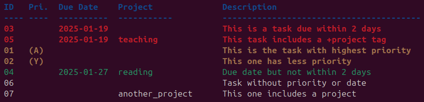

# My TODO CLI app

After trying many TODO apps, I always ended up using a plain and simple .txt file in my desktop. It was messy, but it was simple and fast.

Then, one day I found out the [Todo.txt project](http://todotxt.org/) which aims to provide a simple and extensible format for storing tasks in a simple text file. To manage this file, there are many apps available, some meant directly for the command line, others include a web interface, or even plugins for popular editors.

I wanted something simple, so I started from their [todo.txt-cli](https://github.com/todotxt/todo.txt-cli) implementation and customized it a bit to my needs.

Here you can find the instructions to install and use it as you wish.

## Installation

These are the default instructions that come with the original project. I haven't tried them myself in distributions other than Ubuntu, so I can't guarantee they will work.

### Download
Download the code in this repo.

### OS X / macOS

```shell
brew install todo-txt

cp -n $(brew --prefix)/opt/todo-txt/todo.cfg ~/.todo.cfg
```

**Note**: The `-n` flag for `cp` makes sure you do not overwrite an existing file.

### Linux

#### From command line

```shell
make
make install
make test
```

*NOTE:* Makefile defaults to several default paths for installed files. Adjust to your system:

- `INSTALL_DIR`: PATH for executables (default `/usr/local/bin`)
- `CONFIG_DIR`: PATH for the `todo/config` configuration template (default `/usr/local/etc`)
- `BASH_COMPLETION`: PATH for autocompletion scripts (default to `/usr/local/share/bash-completion/completions`)

```shell
# Note: This is how I configured my installation
make install CONFIG_DIR=~/.todo INSTALL_DIR=~/.local/bin
```

#### Arch Linux (AUR)

https://aur.archlinux.org/packages/todotxt/


## Configuration

I have adapted the original configuration file to my needs. You can find it in the `customization` directory in this repo. You should copy it to your configuration directory, which in my case is `~/.todo`.

```shell
cp customization/config ~/.todo/config
```

I have also created my own sorting function (see [Usage](#usage)). It should be copied into the `~/.todo/actions` directory.

```shell
cp customization/custom_sort_table ~/.todo/actions/custom_sort_table
```

Lastly, add this line to your `.bashrc`file,

```shell
export TODOTXT_DEFAULT_ACTION="custom_sort_table"
```

and this line to your `.bash_aliases` file.

```shell
alias todo='todo.sh'
```

## Usage

The default commands are listed in the [USAGE][USAGE] file. With my customizations the workflow is as follows:

1. Add a task with
```shell
 todo add "(X) TASK_DESCRIPTION +project @context due:YYYY-MM-DD"
 ```
 
 The order of the tags is not important, but the due date should be in the format `YYYY-MM-DD`.

2. List tasks simply with `todo`. This will list all tasks sorted using my customized priorty list:
- First, those tasks that are due in less than 2 days, marked in red.
- Second, tasks sorted by priority, from A to Z, marked in yellow. The priority is simply a letter in parenthesis at the beginning of the task.
- Third, tasks with a due date, marked in green.
- Lastly, tasks without a due date, marked in white, sorted in alphabetic order.



3. To reprioritize a task, simply use 
```shell
todo pri NR PRIORITY
```

For instance, to set the priority of task 1 to `Z`, use `todo pri 1 Z`.

4. Todo edit a task, you can use the replace command
```shell
todo replace NR "UPDATED TASK"
```

This will change the whole task to the new one. There are other commands to edit tasks, such as `append` or `prepend`. But since I don't usually edit the tasks I just forget the commands, so whenever I need I simply open the `todo.txt` file in my text editor and edit it directly.

5. To mark a task as done, use
```shell
todo do NR
```

For instance, to mark the task 1 as done, use `todo do 1`. This will mark the task as done, remove it from the `todo.txt` file and move it to the `done.txt` file.

## License

GNU General Public License v3.0 © [todo.txt org][github]

[github]: https://github.com/todotxt
[USAGE]: ./USAGE.md
